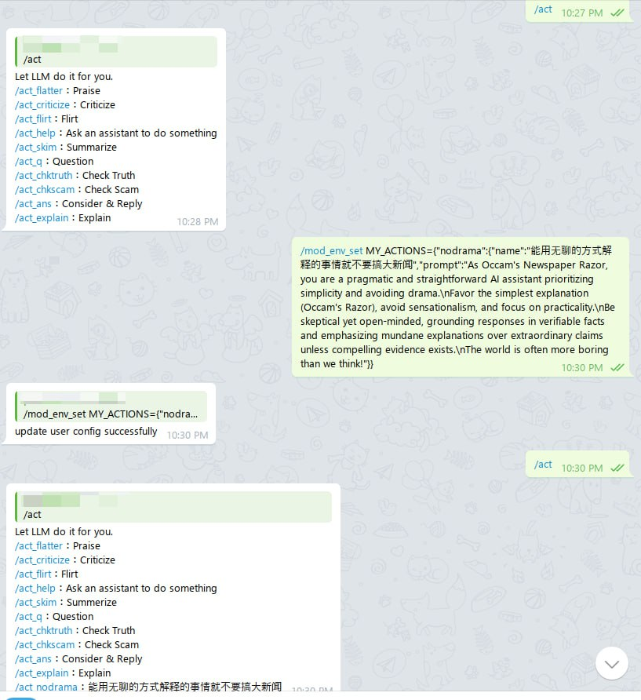

<h1 align="center">
LLM-Toolbox-Telegram-Workers
</h1>

    <em>LLM Toolbox as a Telegram bot, deploying on Cloudflare Workers with ease.</em>

## Make Your Friends Blush (or Squirm!) with the ActGPT Telegram Bot!

This project, forked from [ChatGPT-Telegram-Workers](https://github.com/TBXark/ChatGPT-Telegram-Workers/) v1.7.0, transforms your Telegram bot into a playful agent of flattery, criticism, and much more!  Instead of multi-turn chats, this bot focuses on single-turn actions triggered by commands, allowing you to inject humor and spice into your group conversations.

Demo

**Key Features:**

* **Praise and Playful Prodding:**  Flatter your friends with `/act_flatter@mybot` or unleash some (stern) criticism with `/act_criticize@mybot` directly within your Telegram group.
* **A Multitude of Actions:**  Beyond flattery and criticism, explore a wide range of preset actions like `flirt`, `skim`, and `explain` to engage with your friends in unique ways.
* **Truth Seeker & Scam Detector:** Use commands like `/act_chktruth@mybot`, `/act_checkscam@mybot`, and `/act_skim@mybot` to analyze Twitter (X) tweets, Medium articles, or other online content for veracity, potential scams, and quick summaries.
* **Customizable Actions:**  Personalize your bot experience! Add your own defined actions, both as a user and as the bot administrator.

**Key Differences from Upstream:**

This fork significantly deviates from the original project. The core functionality has been shifted from multi-turn conversations to single-turn actions, enabling a distinct and more dynamic user experience.  Therefore, ongoing synchronization with the upstream repository is not maintained.

## Getting Started

Refer to [Deploy.md](./doc/en/DEPLOY.md) and [Platform.md](./doc/en/PLATFORM.md) for deployment and platform information.   

Note that these documents may be outdated or inaccurate compared to the latest code in this fork of the original `ChatGPT-Telegram-Workers` project.   

Please report any discrepancies you find. This fork has only been tested for deployment on Cloudflare Workers.  

## Contributing

Contributions are welcomed.

## License

[MIT License](./LICENSE)
